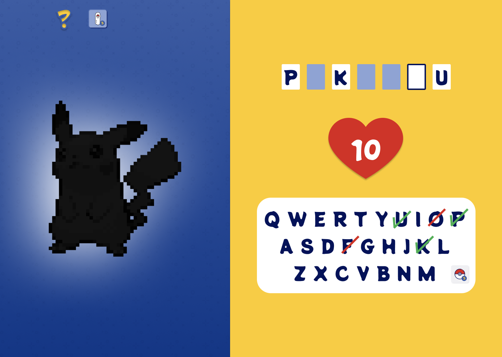
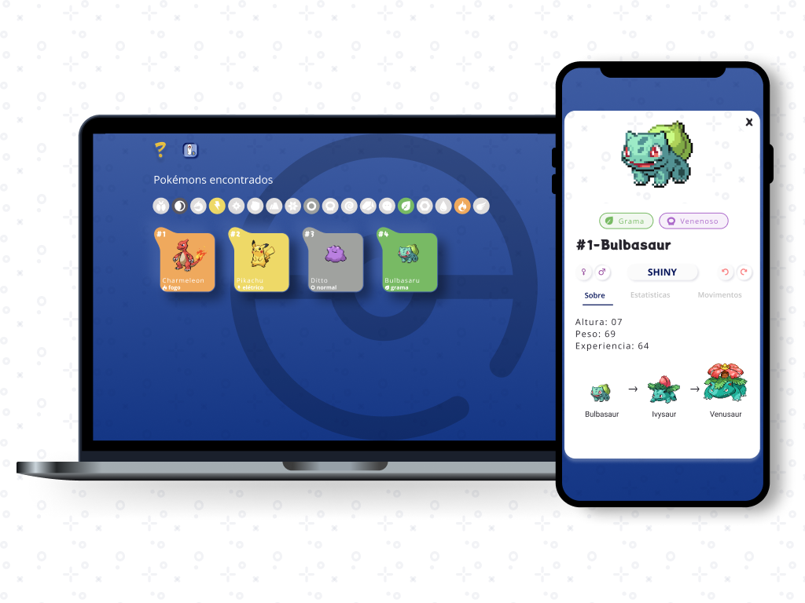

# Quem é esse Pokémon?!

Teste quantos Pokémons você consegue capturar, acertando o nome ( do Pokémon 😜 ).


## Demo

https://quem-e-esse-pokemon.vercel.app

## Screenshots

Layout completo: [Figma](https://www.figma.com/file/HcNw19Nw12iWdjALFWds9Y/1-Quem-%C3%A9-esse-pokemon?node-id=333%3A13309)




## Features

- Captura de Pokémons acertando o nome

#### ***Em breve***

- Pokedex com os Pokémons capturados
- Desenvolvimento de Aplicativo para Android e IOS

## Tecnologias

- [ReactJS](https://reactjs.org/)
- [Typescript](https://www.typescriptlang.org/)
- [Next.js](https://nextjs.org/)

## Execute localmente

Clone o projeto

```bash
  git clone https://link-to-project
```

Vá para a pasta do projeto

```bash
  cd my-project
```

Instale as dependencias

```bash
  npm install
```

Execute a aplicação

```bash
  npm run start
```

## Feedback

Se você gostaria compartilhar algum feedback, você pode criar uma [issue](https://github.com/nurycaroline/quem-e-esse-pokemon/issues/new) ou entrar em contato pelo email: [nurycaroline@gmail.com](nurycaroline@gmail.co)
## License

[MIT](https://choosealicense.com/licenses/mit/)
